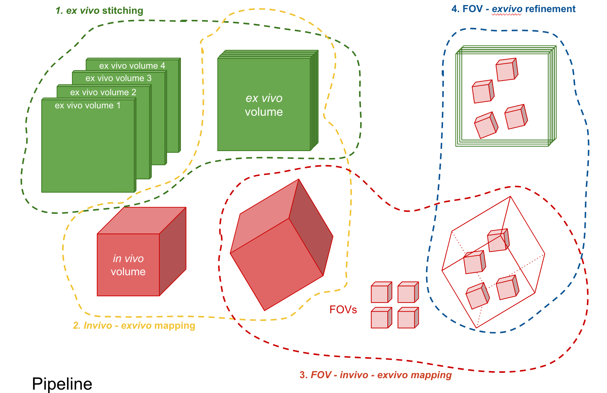

# napari semiautomatic_registration
Multimodal microscopy image registration using napari

**Data**
Assume we have Invivo zstack image, Invivo time-averaged FOVs, and Exvivo images. Each of these images is multiple channels (e.g., GCaMP for the Ca2+ signal, tdTomato for sparse labeling, and some other channel to label markers such as blood vessels). 

We assume all data is processed in the shape of `(C,Z,X,Y)` where `C` is the number of color channel and `Z` is the imaging depth. If there is only one color channel, it should be of size `(1,100,1024,1024)`, for example. If the image is 2D, then it should be `(2,1,2048,2048)`, for example. 

**What does this repo do?**

See above illustration

0. Preprocessing
    1. rescaling the image with the given image resolution 
    2. mainly right now we downsample both exvivo and invivo data
1. Exvivo stitching 
    1. napari to find the transformation `exvivo_stitching_notebook.ipynb`
    2. load the result and stitch everything together. `stitch_results.ipynb`
2. Invivo - Exvivo GUI:
    1. `invivo_to_exvivo.ipynb`
    2. load the GUI and estimate the transformation. Note that the moving image is Invivo and the target image is Exvivo.
3. FOV - Invivo registration: no GUI needed, automatical registration based on the phase correlation and polar transformation
    1. `FOV_to_invivo.ipynb`
    2. this first map FOV to invivo, and then map these transformed FOV to Exvivo (by using the transformation learned in `invivo_to_exvivo.ipynb`)
4. FOV - Exvivo: based on the previous results fine tune the FOV
    1. `refine_FOV_to_exvivo.ipynb`
    2. load the output from above and refine the map from FOV to Exvivo, and save the cell locations in both images.
5. FOV invert transformation 
    1. `FOV_invert_transformation.ipynb`
    2. final script to apply inverse transformation to the locations found on FOV to map back to the original space. 

